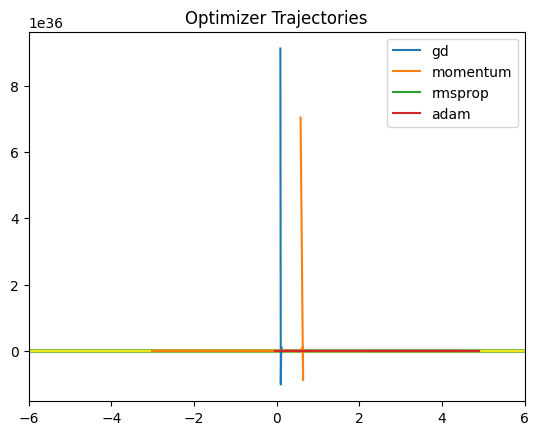
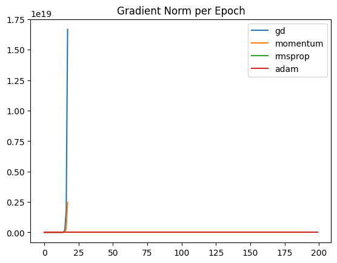
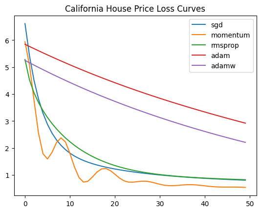
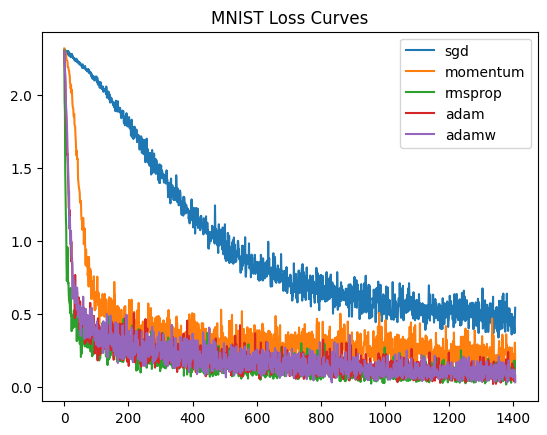

# Optimization Algorithms : 

---

## Objective : 

This repository studies the evolution of **First-order optimization algorithms used for training ML models**.

The goal is to understand optimizers from first principles :

- Optimization problem are we solving  
- Reasons for vanilla gradient descent failure in practice. 
- Impact of conditioning, curvature and stochastic noise affect convergence.  
- Improvement each optimizer provides for a specific limitation of previous methods.
- Optimizer behaviour across different learning settings.  

We benchmark optimizers across three problem settings :

| Setting | Model | Purpose |
|--------|------|---------|
| Synthetic quadratic surface | Parameter vector | Shows optimizer trajectory geometry and conditioning effects |
| California Housing regression | MLP | Shows convergence stability, gradient norms, training speed |
| MNIST classification | Neural network | Shows deep non-convex training behaviour and generalization |

---

## Optimization Problem

We solve:

$$
\min_{\theta \in \mathbb{R}^d} J(\theta)
$$

Where:

- $\theta$ is the parameter vector
- $J(\theta)$ is empirical loss
- $g_t = \nabla J(\theta_t)$ is gradient at iteration $t$

Curvature of the loss surface is described by the **Hessian** :

$$
H = \nabla^2 J(\theta)
$$

If eigenvalues of $H$ vary significantly:

$$
\kappa = \frac{\lambda_{\max}}{\lambda_{\min}} \gg 1
$$

the problem is **ill-conditioned**, leading to slow zig-zag convergence.

---

## Evolution of Optimizers : 

Gradient Descent  
↓  
Stochastic Gradient Descent  
↓  
Mini-Batch Gradient Descent  
↓  
Momentum  
↓  
Nesterov Accelerated Gradient  
↓  
AdaGrad  
↓  
AdaDelta  
↓  
RMSProp  
↓  
Adam  

---

# Gradient Descent (Batch) : 

### Intuition  
Uses exact gradient direction computed on full dataset.  
Stable but computationally expensive and sensitive to conditioning.

### Theory
Gradient descent is the foundation of all optimization in ML. At each step, we calc the gradient of the loss over the **entire dataset** and move the parameters in the direction that most steeply reduces the loss. It is like finding the slope of a hill and always stepping downhill. The problem is that real loss surfaces are rarely smooth bowls; they tend to be elongated, narrow valleys where the gradient points mostly sideways instead of toward the bottom. This causes the optimizer to zig-zag slowly rather than glide straight down. The condition number $\kappa$ measures how stretched the valley is: the higher it is, the worse the zig-zagging.

### Technical Insight  
For quadratic loss:

$$
J(\theta)=\frac{1}{2}\theta^T H \theta
$$

Update becomes:

$$
\theta_{t+1}=(I-\eta H)\theta_t
$$

Convergence rate depends on spectral radius:

$$
\rho = \max_i |1-\eta\lambda_i|
$$

### Time Complexity  
- Per step: $O(nd)$

### Shortcomings  
- Slow for large datasets  
- Severe oscillation in narrow valleys  
- Requires small learning rate  

---

# Stochastic Gradient Descent : 

### Intuition  
Uses gradient from a single sample.  
Cheap updates but introduces noise.

### Theory
Instead of computing the gradient over the whole dataset, SGD estimates it from a **single randomly sampled example** at each step. This makes each update extremely cheap and allows the model to start learning immediately. The trade-off is noise: the gradient from one sample is a rough approximation of the true gradient, so the path through parameter space is jagged and erratic. Crucially, this noise is not always a liability; it naturally prevents the optimizer from settling into sharp, narrow minima, often pushing it toward flatter regions that generalize better. SGD is the backbone of modern deep learning, typically used with a decaying lr schedule to trade noise for precision as training progresses.

### Technical Insight  
Gradient estimator:

$$
\mathbb{E}[g_t]=\nabla J(\theta_t)
$$

Variance:

$$
\mathrm{Var}(g_t)=\sigma^2
$$

Noise helps escape saddle points.

### Time Complexity  
- Per update: $O(d)$

### Shortcomings  
- High variance updates  
- Oscillatory convergence  

---

# Mini-Batch Gradient Descent : 

### Intuition  
Balances stability and computational efficiency.

### Theory
Mini-batch GD is the practical sweet spot between vanilla GD and SGD. Instead of one sample or all samples, you compute the gradient over a small **batch** (typically 32–512 examples). The gradient estimate is much less noisy than SGD because errors from individual samples partially cancel out, but the computation per step is still far cheaper than full-batch GD. Mini-batches align perfectly with modern GPU hardware; matrix operations over a batch of inputs are parallelised almost for free. The batch size $b$ directly controls the bias-variance trade-off; larger batches give smoother gradients but can converge to sharper minima; smaller batches retain beneficial noise.

### Technical Insight  
Gradient estimate:

$$
g_t=\frac{1}{b}\sum_{i=1}^b \nabla L_i(\theta_t)
$$

Variance reduces:

$$
\mathrm{Var}(g_t)=\frac{\sigma^2}{b}
$$

### Time Complexity  
- Per step: $O(bd)$

### Shortcomings  
- Requires batch size tuning  

Improvement: reduced variance compared to SGD.

---

# Momentum (Polyak Heavy Ball) : 

### Intuition  
Accumulates gradient history to accelerate in consistent directions and damp oscillations.

### Theory
Momentum fixes the zig-zag problem by giving the optimizer a kind of **inertia**. Rather than taking a fresh step based only on the current gradient, it maintains a velocity vector $v_t$ — a running average of past gradients. In directions where the gradient consistently points the same way, velocity accumulates and the optimizer accelerates. In directions where the gradient flips sign (the zig-zag directions), past and current gradients cancel and the oscillation dampens. The analogy is a ball rolling down a valley: it builds up speed in the downhill direction and doesn't get thrown sideways by every small bump. The momentum coefficient $\beta$ (typically 0.9) controls how much history is retained — effectively letting the optimizer "look back" over roughly $\frac{1}{1-\beta}$ past steps.  

### Technical Insight  
Velocity update:

$$
v_t=\beta v_{t-1}+g_t
$$

Parameter update:

$$
\theta_{t+1}=\theta_t-\eta v_t
$$

Unrolled:

$$
v_t=\sum_{k=0}^{t}\beta^{t-k} g_k
$$

Second-order dynamics:

$$
z_{t+1}=(1+\beta-\eta\lambda_i)z_t-\beta z_{t-1}
$$

Improves convergence from $O(\kappa)$ to $O(\sqrt{\kappa})$.

### Time Complexity  
- $O(d)$

### Shortcomings  
- Same learning rate for all parameters  
- Overshoot possible  

Improvement: solves conditioning and zig-zag problem.

---

# Nesterov Accelerated Gradient(NAG) : 

### Intuition  
Computes gradient at predicted future position.

### Theory
Nesterov's key insight is that momentum already tells us approximately **where we're going next**; so why compute the gradient from where you are now. Instead, NAG first takes the momentum step to the predicted future position $\tilde{\theta}_t$, and then computes the gradient there. This gives the optimizer a chance to "look ahead" and correct itself before it overshoots. In practice, this small change in the order of operations produces meaningfully faster convergence and better behaviour near minima, particularly for convex problems. The theoretical guarantee of $O(1/t^2)$ convergence (vs $O(1/t)$ for vanilla GD) makes it one of the few optimizers with a provably optimal convergence rate.

### Technical Insight  

$$
\tilde{\theta}_t=\theta_t-\eta\beta v_{t-1}
$$

$$
g_t=\nabla J(\tilde{\theta}_t)
$$

Provides optimal convex convergence:

$$
O(1/t^2)
$$

### Time Complexity  
- $O(d)$

### Shortcomings  
- Sensitive hyperparameters  
- Still global learning rate  

Improvement: earlier curvature feedback.

---

# AdaGrad : 

### Intuition  
Uses smaller learning rates for frequently updated parameters.

### Theory
All the optimizers so far use one global learning rate $\eta$ for every parameter. AdaGrad challenges this: parameters that appear frequently in the data (e.g., common word embeddings in NLP) receive many large gradient updates and should slow down, while rare parameters should keep learning quickly. AdaGrad achieves this by **accumulating the sum of squared gradients** $r_t$ for each parameter independently. The effective learning rate for parameter $i$ becomes $\eta / \sqrt{r_{t,i}}$; the more a parameter has been updated, the smaller its learning rate becomes. This is equivalent to pre-conditioning the gradient by a diagonal approximation of the inverse Hessian, making it the first optimizer that implicitly adapts to the local geometry of the loss surface per-parameter.

### Technical Insight  

$$
r_t=r_{t-1}+g_t^2
$$

$$
\theta_{t+1}=\theta_t-\frac{\eta}{\sqrt{r_t+\epsilon}}g_t
$$

Equivalent to diagonal preconditioning:

$$
\Delta\theta=-\eta D_t^{-1/2}g_t
$$

### Time Complexity  
- $O(d)$

### Shortcomings  
- Learning rate decays to zero  

Improvement: per-parameter adaptive scaling.

---

# AdaDelta : 

### Intuition  
Removes monotonically shrinking learning rate.

### Theory
AdaGrad's fatal flaw is that $r_t$ grows without bound; it sums squared gradients forever, so the learning rate for every parameter eventually collapses to zero and training stops. AdaDelta fixes this by replacing the infinite sum with an **exponentially decaying moving average** of squared gradients, using a decay factor $\beta$ that forgets old history. Only the recent gradient magnitudes matter. A second elegant fix: AdaDelta eliminates the learning rate hyperparameter $\eta$ entirely by replacing it with an RMS of recent parameter updates, making the effective step size self-normalising and dimensionally consistent. In practice this means AdaDelta is surprisingly robust to the choice of hyperparameters.

### Technical Insight  

$$
E[g^2]_t=\beta E[g^2]_{t-1}+(1-\beta)g_t^2
$$

$$
\Delta\theta_t=
-\frac{\sqrt{E[\Delta\theta^2]_{t-1}}}{\sqrt{E[g^2]_t}}g_t
$$

Effective LR:

$$
\eta_{\text{eff}}=
\frac{\text{RMS}(\Delta\theta)}{\text{RMS}(g)}
$$

### Time Complexity  
- $O(d)$

### Shortcomings  
- Slower convergence  

Improvement: prevents AdaGrad decay.

---

# RMSProp : 

### Intuition  
Uses exponentially weighted variance estimate.

### Theory
RMSProp was developed independently by Hinton (unpublished) around the same time as AdaDelta and arrives at almost the same fix: replace AdaGrad's accumulating sum with an **exponential moving average** of squared gradients. The effective learning rate for each parameter is $\eta / \sqrt{s_t}$, where $s_t$ tracks the recent magnitude of gradients. Parameters with consistently large gradients get smaller steps; parameters with small gradients get larger steps. Unlike AdaDelta, RMSProp keeps an explicit learning rate $\eta$ which makes it more tunable. It behaves like a **stochastic diagonal Newton method**; approximating the curvature of the loss surface per parameter without ever computing the full Hessian. It became the go-to optimizer for RNNs before Adam arrived.

### Technical Insight  

$$
s_t=\beta s_{t-1}+(1-\beta)g_t^2
$$

$$
\theta_{t+1}=\theta_t-\frac{\eta}{\sqrt{s_t}}g_t
$$

Acts as stochastic diagonal Newton step.

### Time Complexity  
- $O(d)$

### Shortcomings  
- No momentum smoothing  

Improvement: stable adaptive scaling.

---

# Adam : 

### Intuition  
Combines momentum and adaptive scaling.

### Theory
Adam (Adaptive Moment Estimation) is the synthesis that the field had been building toward. It combines **two ideas**: the smoothed gradient direction from momentum (first moment $m_t$), and the per-parameter adaptive scaling from RMSProp (second moment $v_t$). The first moment is a running average of gradients — it smooths out noise and builds inertia in consistent directions. The second moment is a running average of squared gradients; it normalises the step size per parameter. The **bias correction** terms $\hat{m}_t$ and $\hat{v}_t$ are critical at the start of training: without them, both moments are initialised at zero and the early steps are severely under-estimated. Adam typically converges fast and requires minimal tuning, which is why it dominates in practice. Its known weakness is a tendency to converge to sharp, narrow minima that may generalise poorly — which AdamW addresses by adding weight decay directly to the parameter update rather than the gradient.

### Technical Insight  

First moment:

$$
m_t=\beta_1 m_{t-1}+(1-\beta_1)g_t
$$

Second moment:

$$
v_t=\beta_2 v_{t-1}+(1-\beta_2)g_t^2
$$

Bias correction:

$$
\hat m_t=\frac{m_t}{1-\beta_1^t}
$$

$$
\hat v_t=\frac{v_t}{1-\beta_2^t}
$$

Update:

$$
\theta_{t+1}=\theta_t-\frac{\eta}{\sqrt{\hat v_t}}\hat m_t
$$

Equivalent to momentum in adaptive coordinate space.

### Time Complexity  
- $O(d)$

### Shortcomings  
- Converges to sharp minima  
- Higher memory  

Improvement: combines direction smoothing + variance normalization.

---

## Experimental Results
 
Results from training across all three benchmark settings. Each optimizer was run under identical conditions per experiment.
 
---
 
### Experiment 1 -> Synthetic Quadratic Surface : 
 
This experiment isolates raw optimizer geometry on a controlled ill-conditioned quadratic surface. There is no data noise — only the optimizer's response to curvature.
 

 
The trajectory plot tells the story immediately. GD and Momentum diverge catastrophically; their values explode to magnitudes on the order of $10^{36}$, a textbook symptom of a learning rate that is too large for the condition number of the surface. The zig-zag instability amplifies rather than dampens. RMSProp and Adam, by contrast, adapt their step sizes per-dimension and navigate the same surface stably, their trajectories barely visible at the bottom of the chart because they are converging rather than exploding.
 
| Optimizer | Final Loss | Time (s) |
|-----------|------------|----------|
| GD | NaN (diverged) | 0.1777 |
| Momentum | NaN (diverged) | 0.0729 |
| RMSProp | **499.91** | 0.1197 |
| Adam | **8.50 × 10⁻⁷** | 0.0977 |
 
**Takeaway** :  On ill-conditioned surfaces, a fixed global learning rate is a liability. GD and Momentum diverge entirely. Adam converges to near-zero loss; RMSProp converges but to a higher residual. Adaptive methods are not just faster here, they are the only ones that work at all.
 
---
 
### Experiment 2 —> California Housing(Regression) : 
 
A real regression task on tabular data. Metrics are R² (higher is better), MAE, MSE, and per-step time.
 

 
The gradient norm plot shows GD spiking to $10^{19}$ around epoch 15 before collapsing; a near-divergence that it recovers from only because the learning rate happens to be small enough to survive. Momentum follows a similar spike. Adaptive methods (RMSProp, Adam) stay flat and stable from the very first epoch, reflecting their ability to normalise gradient magnitudes automatically.
 

 
The loss curves reinforce this. SGD and Momentum converge steadily to low loss. Adam and AdamW start with surprisingly high loss and descend slowly; likely a consequence of the adaptive scaling being mismatched to this particular regression task's gradient distribution. RMSProp finds the best balance.
 
| Optimizer | R² | MAE | MSE | Time/Step (s) |
|-----------|-----|-----|-----|---------------|
| SGD | **0.906** | 0.382 | 0.432 | 0.000809 |
| Momentum | 0.721 | 0.608 | 0.430 | 0.000801 |
| RMSProp | 0.893 | 0.402 | 0.408 | 0.000772 |
| Adam | -1.751 | 1.276 | 0.427 | 0.001167 |
| AdamW | -1.545 | 0.845 | 0.501 | 0.001091 |
 
**Takeaway** : SGD wins on R² here, which is a useful reminder that adaptive methods are not universally superior. On well-scaled tabular data with a smooth loss surface, a well-tuned SGD can outperform Adam. Momentum underperforms, suggesting overshoot on this surface. Adam and AdamW show negative R², indicating they failed to beat a mean-prediction baseline, likely a learning rate or scaling issue specific to this setup.
 
---
 
### Experiment 3 —> MNIST Classification : 
 
Deep non-convex training on image classification. Metrics are accuracy, training time, and per-step memory cost.
 

 
The loss curves reveal clear convergence tiers. SGD crawls down slowly and remains noisy throughout; still above 0.5 loss at 1400 steps where adaptive methods have nearly converged. Momentum improves considerably but still shows high variance. RMSProp, Adam, and AdamW cluster tightly at the bottom, converging fast and stabilising early, with AdamW showing the smoothest tail.
 
| Optimizer | Accuracy | Training Time (s) | Time/Step (s) |
|-----------|----------|-------------------|---------------|
| SGD | 88.63% | 27.997 | 0.001908 |
| Momentum | 94.04% | 26.917 | 0.001955 |
| RMSProp | **97.01%** | 31.833 | 0.002058 |
| Adam | 96.96% | 28.610 | 0.001955 |
| AdamW | 96.84% | 29.292 | 0.003005 |
 
**Takeaway** : Momentum alone lifts SGD by +5.4pp. Adaptive methods push further to ~97%. RMSProp edges out Adam by a small margin. AdamW is the most expensive per step due to its dual moment storage plus weight decay, but its smooth convergence tail makes it the most reliable choice for longer training runs.
 
---
 
### Cross-Experiment Summary : 
 
| Optimizer | Synthetic (loss) | Housing (R²) | MNIST (accuracy) |
|-----------|-----------------|--------------|------------------|
| GD / SGD | ❌ Diverged | 0.906 | 88.63% |
| Momentum | ❌ Diverged | 0.721 | 94.04% |
| RMSProp | 499.91 | 0.893 | **97.01%** |
| Adam | **~0.000** | -1.751 | 96.96% |
| AdamW | — | -1.545 | 96.84% |
 
No single optimizer wins across all three settings. Adam dominates on ill-conditioned geometry and deep networks. SGD is surprisingly competitive on well-scaled tabular data. The practical recommendation is Adam or AdamW as a default, with SGD worth trying when the data is well-normalised and the model is shallow.
 
---

## Comparison Table

| Optimizer | TC/Step | Space | Adaptive | Momentum | Convergence Speed | Generalization | Noise Stability | Failure Risk |
|-----------|--------|------|----------|----------|------------------|---------------|---------------|-------------|
| GD | O(d) | O(d) | No | No | Slow | Good | Low | Stuck |
| SGD | O(d) | O(d) | No | No | Medium | Good | Medium | Oscillation |
| MiniBatch | O(d) | O(d) | No | No | Fast | Good | Medium | Batch tuning |
| Momentum | O(d) | O(2d) | No | Yes | Faster | Very Good | Medium | Overshoot |
| NAG | O(d) | O(2d) | No | Yes | Very Fast | Good | Medium | Sensitive |
| AdaGrad | O(d) | O(2d) | Yes | No | Fast early | Medium | High | LR collapse |
| AdaDelta | O(d) | O(3d) | Yes | No | Medium | Medium | Medium | Slow |
| RMSProp | O(d) | O(2d) | Yes | No | Fast | Medium | Good | Instability |
| Adam | O(d) | O(3d) | Yes | Yes | Very Fast | Sometimes worse | High | Sharp minima |

---
